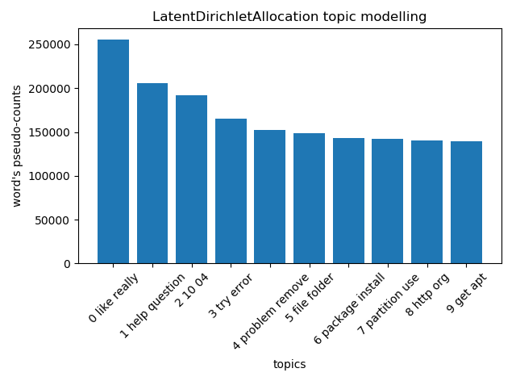
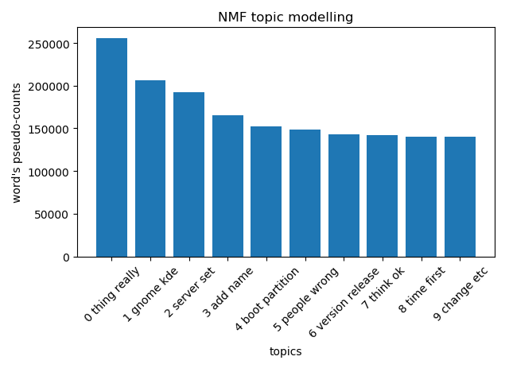

Topic analysis of the Ubuntu Dialogue Corpus v1.0
==========================

This project aims at analyzing the [Ubuntu Dialogue Corpus v1.0](http://dataset.cs.mcgill.ca/ubuntu-corpus-1.0). The goal is to identify common topics in the conversations. This knowledge should help someone like the "Ubuntu team" to improve their
future versions of Ubuntu. We restrict our analysis to the "dialogs/4" folder. 

The code is written in python. There is 1 routine:

* analysis.py: it performs the full topic modelling. __It is intended to be used e.g. in an IPython session, not as a script__.
 
Here we report the version of the libraries used:

* Python 2.7.14
* numpy 1.12.1
* sklearn 0.19.1
* spacy 1.9.0
* matplotlib 2.1.0
* nltk 3.2.4

__Note on spaCy__: there are some issues of compatibility with the latest 2.x version of spaCy and Anaconda, that's why I did not upgrade to the latest version. The syntax of the used spaCy version is not compatible with version 2.x

Please use this command to install the version used in this task: conda install -c conda-forge spacy=1.9.0. 

# Topic modelling

For topic modelling, we used _Latent Dirichlet Allocation (LDA)_ and _Non-negative Matrix Factorization (NMF)_.  The mathematical basis underlying NMF differs from LDA. We compared the results of both of the algorithms. In the final part we will discuss an application of the _PageRank_ algorithm to rank topics.

Both algorithms are able to return the documents that belong to a topic in a corpus and the words that belong to a topic. LDA is based on probabilistic graphical modeling while NMF relies on linear algebra. 

Both algorithms take as input a bag of words matrix X (i.e., each document represented as a row, with each columns containing the count of words in the corpus). The aim of each algorithm is then to produce 2 smaller matrices W and H; a document to topic matrix and a word to topic matrix that when multiplied together reproduce the bag of words matrix with the lowest error.

For the NMF, in particular, we used the Kullback-Leibler (KL) divergence as Beta divergence to be minimized, measuring the distance between X and the dot product WH. KL is a fundamental equation of information theory that quantifies the proximity of two probability distributions p and q. 

Note that both NMF and LDA are not able to automatically determine the number of topics and this must be specified a priori (here we set it to 50).

#Dataset Preprocessing
Conversations are in the form of a .tsv file, and they have been merged into a text matrix, one conversation per row.

From this text matrix, the creation of the bag of words matrix is very easy in Scikit Learn . A tf-idf transformer is applied to the bag of words matrix that NMF must process with the TfidfVectorizer. Tf–idf is a short for term frequency–inverse document frequency, and it is a numerical statistic that is intended to reflect how important a word is to a document in a collection or corpus. The 'term-frequency' term is simply a count of the number of times a word appears in a given context, while the 'inverse document frequency' term puts
a penalty on how often the word appears elsewhere in the corpus. The intuition of this method is to give high weight to any term that appears often in a particular document, but not in many documents in the corpus. If a word appears often in a particular document, but not in very many documents, it is likely
to be very descriptive of the content of that document.

LDA, being a probabilistic graphical model, only requires raw counts, so a CountVectorizer is used. 

Stop words and punctuation are removed and the number of terms included in the bag of words matrix is restricted to the top 10000 words. 

We used a custom tokenizer for both CountVectorizer and TfidfVectorizer, which extract the lemma of the words via [spaCy](https://spacy.io/). Note that we do not use Stemming. Stemming is always restricted to trimming the word to a stem, so "was" becomes
"wa", while lemmatization can retrieve the correct base verb form, "be". Similarly,
lemmatization can normalize "worse" to "bad", while stemming produces "wors".

Finally, we define a vocabulary from CountVectorizer and give it in input to TfidfVectorizer, to perform later a consistency comparison between LDA and NMF.

We then initialize NMF and LDA. 

Initializing the W and H matrices in NMF with 'nndsvda' rather than random initialization improves the time it takes for NMF to converge. We set beta_loss to 'kullback-leibler' and regularization mixing parameter to 0.5, which represent the trade-off between L1 and L2 regularization.

LDA can also be set to run in either batch or online mode. We used the
"batch" learning method, which is somewhat slower than the default ("online") but
usually provides better results, and increase "max_iter", which can also lead to better
models.

When building the vocabulary we ignored terms that have a document frequency strictly lower than the given threshold min_df (15 words). Likewise, we ignored the top 5% words in terms of frequency.

# Topics learnt

The derived topics from NMF and LDA are displayed below.  Topics are not labeled by the algorithm -  a numeric index is assigned. We report below the most significant words for each topic (sorted by their probability to belong to the i-th topic). From the NMF derived topics, Topic 0 and 5 don’t seem to be about anything in particular but the other topics can be interpreted based upon their top words. LDA produces 1 topic with noisy data (i.e., Topic 0) and it is hard to interpret. 

The top 10 topics are selected by sorting (descending order) all the topics from LDA (or NMF) by pseudo-counts. Indeed, since the complete conditional for topic word distribution is a Dirichlet, the lda_components_[i,j] can be viewed as pseudocounts that represent the number of times word j was assigned to topic i.

__LDA 10 top topics__:  
Topic 0: like really know would use think never one  
Topic 1: help question ask someone please anyone ne answer  
Topic 2: 10 04 ubuntu version upgrade release update 11  
Topic 3: try error get fix problem fail message say  
Topic 4: problem remove happen work mouse cause reboot reinstall  
Topic 5: file folder directory home copy delete permission create  
Topic 6: package install instal synaptic repository deb ubuntu remove  
Topic 7: partition use disk space drive format datum swap  
Topic 8: http org com ubuntu www php help wiki  
Topic 9: get apt install sudo update list source cache 

 
 
 
__NMF  10 top topics__:  
Topic 0: thing really even though probably stuff anything actually  
Topic 1: gnome kde click screen switch theme panel icon  
Topic 2: server set machine ssh access via ip port  
Topic 3: add name kernel option menu module available remember  
Topic 4: boot partition grub os ubuntu ntfs xp reinstall  
Topic 5: people wrong keep nothing happen talk offtopic language  
Topic 6: version release dapper yet breezy late last hoary  
Topic 7: think ok mean sorry dont ne yeah cant  
Topic 8: time first script every mode slow test vmware  
Topic 9: change etc xorg edit conf setting configure monitor  

  

 

Below we offer a plot for the top 10 topic extracted from NMF and LDA. For each topic we report only the 2 most significant words.

 
 
 
 
# Topic detector
The last part of the task is to write a classifier (or topic detector) , so given a random conversation, it will generate a set of relevant topics mentioned. 

We split the conversations numbers (that is 'xxx' if the file is 'xxx.tsv') into a train (<100000) and test dataset (>100000 and <200000). 

Both datasets are preprocessed via a CountVectorizer (see above for further details) in order to obtain a _tf_ matrix. We then fit an LDA model (with 10 topics) on the train _tf_, and used the _transform_ method for LDA to convert dialogues to a probability array (for both train and test datasets), where the i-th element would represent the probability of belonging to the i-th topics. The argmax of such array provides the topic id for both train and test classification variable _y_.

One the data have been preprocessed we fit a Naive Bayes classifier for multinomial models on the train _tf_. The scoring (on test datasets) provides an accuracy of ~0.85.

# Final considerations

Identifying the top 10 most popular topics calls for some prudence, being arbitrary the way we define "popular" a topic. We have seen that e.g. in the LDA the top 10 topics are selected by sorting (descending order) all the topics  by pseudo-counts.

We point out that LDA hinges on the tf distribution of words, whereas NMF on the tf-idf. The latter should be more robust in identifying _hot_ topics, giving high weight to any term that appears often in a particular document, but not in many documents in the corpus.

Recently, another technique has been proposed to identify top topics, namely the PageRank algorithm. PageRank is an algorithm used by Google Search to rank websites in their search engine results. PageRank works by counting the number and quality of links to a page to determine a rough estimate of how important the website is. The underlying assumption is that more important websites are likely to both receive more links from other websites and have more total "clicks".

PageRank is simply a Markov matrix, that is a square matrix used to describe the transitions of a Markov chain. Each of its entries is a non-negative real number representing the probability of moving from state _i_ to _j_ in one time. In other words, each row of P can be regarded as a probability mass function over n_features possible outcomes. A given Markov matrix P can have
many stationary distributions, that is a probability distribution that remains unchanged in the Markov chain as time progresses. 

PageRank has been proposed to capture the interactions among sentences or topics. We recovered the PageRank matrix from the _transform_ method for LDA to convert one dialogue to a probability array, where the i-th element would represent the probability of belonging to the i-th topics. For the recovered Markov matrix, we recovered the stationary distribution of the stochastic matrix PageRank. 

Let’s think of PageRank(i,j) as the probability of “moving” from a topic i to a topic j. The value PageRank(i,j) has the interpretation P(i,j) = 1/k if i has k outbound links, and j is one of them. P(i,j) = 0 if i has no direct link to j. Thus, motion from a topic to another is that of a document surfer who moves by randomly (that is with equal probability) selecting one topic on that document.

In our case P(i,j) does not have uniform probability distribution - a conversation has different probabilities to be related to some topics - and its elements can be used to rank the importance of difference topics. 

Again, wrt to previous methods, with PageRank we include both the effect of _popularity_ (that is frequency) and _interaction_ (a conversation can touch multiple topics) among topics. We report the top 10 topics below. We point out that the first 3 topics are the same wrt LDA, but there are some differences in the order of others. 

__LDA  10 top topics ranked via PageRank__: 

Topic 0: like really know would use think never one  
Topic 1: help question ask someone please anyone ne answer  
Topic 2: 10 04 ubuntu version upgrade release update 11  
Topic 3: lol oh debian ah thx ok bad think  
Topic 4: ubuntu channel support join offtopic bug please chat  
Topic 5: file folder directory home copy delete permission create  
Topic 6: package install instal synaptic repository deb ubuntu remove  
Topic 7: problem remove happen work mouse cause reboot reinstall  
Topic 8: get apt install sudo update list source cache  
Topic 9: try error get fix problem fail message say 

